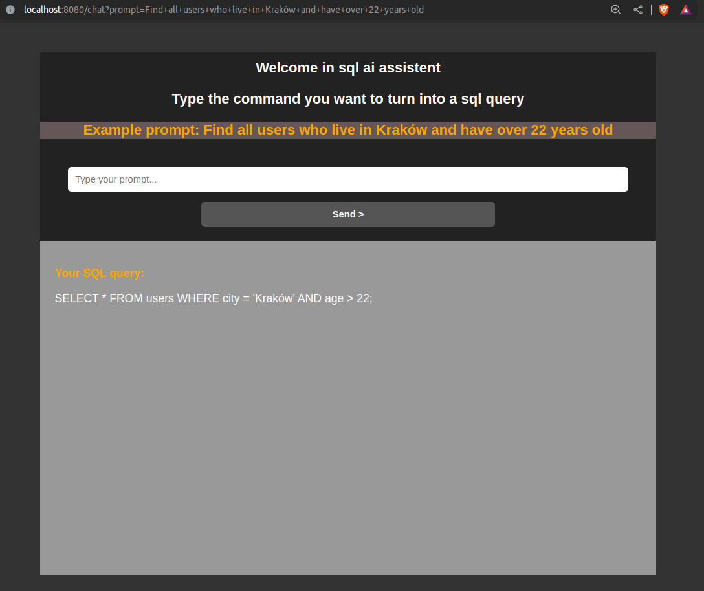

# OpenApi Sqler
OpenAi api assistant programmed to deliver sql queries based on supplied commands.
 For example: "Find all users who live in Krakow and have over 22 years old" 
  returns "SELECT * FROM users WHERE city = 'Krakow' AND age > 22;".
 

 
Backend: Java, Spring boot
 
Front: Thymeleaf